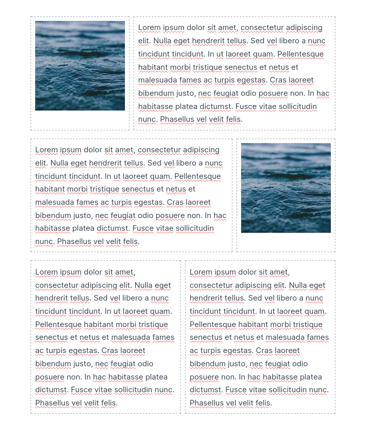

# lexical-grid

Grid plugin for Lexical @lexical/react



## How to use

Add nodes to the editor

```ts
const Nodes: Array<Klass<LexicalNode>> = [
    ..., // other nodes
    GridContainerNode,
    GridRowNode,
    GridColumnNode,
];

export default Nodes;
```

Add the plugin to the editor

```tsx
return () => <GridPlugin />;
```

Add Styles (tailwindcss)

```css
.Grid__container {
    @apply grid gap-2 p-1 my-2;
}
.Grid__row {
    @apply grid gap-2 grid-flow-col auto-cols-fr;
}
.Grid__column {
    @apply p-2 border border-gray-400 border-dashed rounded;
}
```

## Example

```tsx
return () => (
    <Button
        onClick={() => {
            showModal("Añadir grid", (onClose) => (
                <InsertGridDialog
                    activeEditor={activeEditor}
                    onClose={onClose}
                />
            ));
        }}
    >
        <PlusCircledIcon className="mr-2 h-5 w-5" />
        Add grid
    </Button>
);
```
